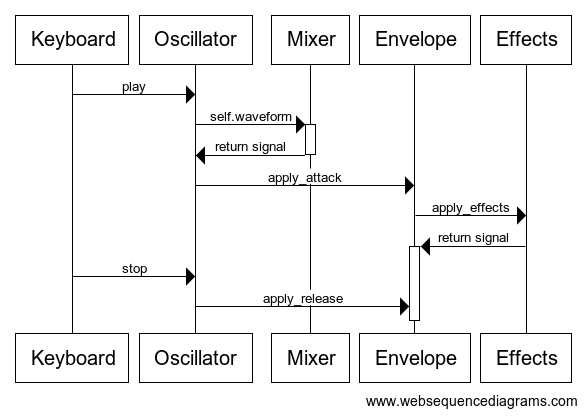
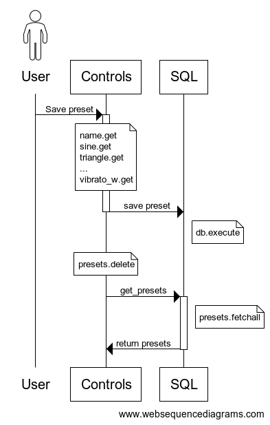
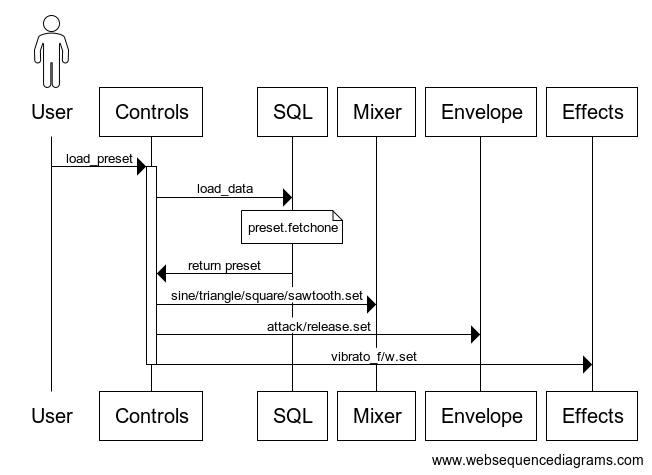

# Sovellusarkkitehtuuri

## Rakenne

Sovelluksen koodi on jaettu kolmeen kansioon: *signal prosessing*, *sql* ja *user interface*. Näistä ensimmäinen sisältää äänen tuottamiseen ja muokkaamiseen liittyvän koodin, toinen tietokantaan liittyvät toiminnot ja viimeinen käyttöliittymän. *Main.py*-tiedosto alustaa kaikki luokkaoliot ja pitää ohjelman pyörimässä.

## Sovelluslogiikka

### Signaalinkäsittely

Signaalinkäsittelyosion keskiössä on säännöllisten taajuuksien tuottaja eli oskillattori. *Oscillator*-luokka kutsuu nuottien taajuusluetteloa *tuner*-moduulista ja aaltomuotoa *WaveMixer*-luokasta. Kun ääni halutaan soittaa, kutsutaan luokkaa *Envelope*, joka luo verhokäyrän eli alukkeet ja lopukkeet. *Envelope*-luokka puolestaan kutsuu *Effects*-luokasta mahdollisia efektejä.

### Käyttöliittymä

Käyttöliittymässä on kaksi eri ikkunaa: *Visuals* on staattinen ja vihjaa käyttäjälle, millä näppäimillä on käyttöarvoa, kun taas *Controls* sisältää kaiken käyttäjän säädettävän. Pakkauksessa on kolmas moduuli, *Keyboard* joka ottaa vastaan näppäimistöllä tapahtuvan toiminnan ja välittää komennot eteenpäin virittimelle tai oskillaattorille. Käyttöliittymäpakkauksen sisäiset moduulit eivät kommunikoi keskenään.

*Controls-paneelissa on liukusäätimiä äänen muuttamista varten*

### Kutsut pakkausten välillä

Käyttöliittymän *Controls*-luokka syöttää tietoa jokaiseen signaalinkäsittypakkauksen luokkaan. *Keyboard*-moduuli kutsuu komentoja ainoastaan *Oscillator*-luokasta. SQL-toiminnot ovat yhteydessä ainoastaan *Controls*-luokkaan.

## Pysyväistallennus

Ohjelma käyttää SQLite-tietokantaa esiasetusten eli presettien tallentamiseen. Tietokanta koostuu yhdestä taulukosta, jossa on tiedossa kunkin presetin nimi, ja äänenväriin vaikuttavien liukusäätimien asennot. (Näitä ovat kaikki säätimet paitsi viritys ja kokonaisäänenvoimakkuus.)

Sekä tallentaminen, että lataaminen tapahtuu *Controls*-luokan avulla nappia painamalla. Lisäksi sovellus mahdollistaa presetin poistamisen ja alkuperäisten esiasetusten palauttamisen.

## Toiminnallisuudet

Seuraava kaavio kuvastaa *Oscillator*-luokan toimintaa ääni soitettaessa:

Näppäimistö lähettää oskillaattorille soittokäskyn, jolloin tämä hakee mikseriltä oikean aaltomuodon ja sitten käskee Envelope-luokkaa soittamaan äänen. Envelope hakee ensin mahdolliset efektit. Kun käyttäjä nostaa sormensa näppäimeltä, välittää oskillaattori Envelopelle käskyn lopettaa äänen toistaminen.

Alla on kuvaukset presetin tallentamis- ja lataamisprosesseista:

Käyttäjä haluaa tallentaa presetin, jolloin Controls-luokka kerää kaikki tarvittavat liukusäätimien tiedot ja lähettää ne SQL-luokan tallennettavaksi. Tallennuksen jälkeen Controls-luokka pyyhkii vanhan preset-valikoiman tyhjäksi ja täyttää sen uudestaan päivitetyllä listalla. (Tyhjennys liittyy tkinterin OptionMenu-valikon syntaksiin.)

Käyttäjä lataa presetin, jolloin Controls-luokka pyytää SQL-luokalta presetin tietoja. Tämän jälkeen Controls-luokka asettaa tiedot liukusäätimiin, mikä muuttaa signaalinkäsittelyluokkien muuttujia.

### Muista toiminnallisuuksista

Sama signaalinkäsittelyluokkien muuttuminen toistuu myös, kun käyttäjä säätää manuaalisesti jotakin liukusäädintä: jos esimerkiksi *tuning*-säädintä liikutetaan, kutsuu toiminto *Oscillator*-luokan metodia *retune*, joka puolestaan kutsuu funktiota *tuner*. Tällöin oskillattoriin palautuu uusi taajuuksien lista, joka vastaa koskettimistolla saatavia säveliä eri viritysjärjestelmässä kuin aiemmin.
