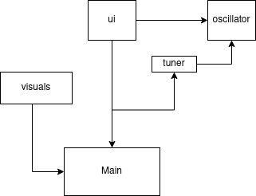

## Sovellusarkkitehtuuri

Sovellus koostuu tällä hetkellä main-ohjelmasta ja neljästä sitä tukevasta moduulista:
- *ui* käsittelee näppäimistöltä tulevat komennot
- *tuner* laskee oikeat taajuudet viritysäänen pohjalta
- *oscillator* tuottaa äänet halutuilla äänenväreillä ja
- *visuals* vastaa käyttöliittymän ulkoasusta

