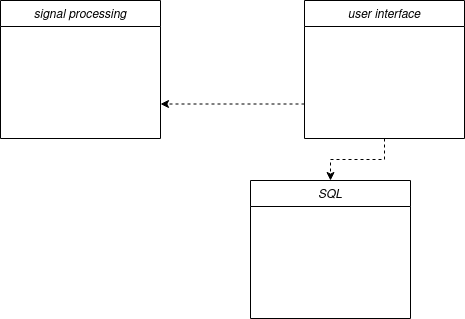
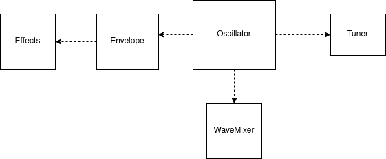
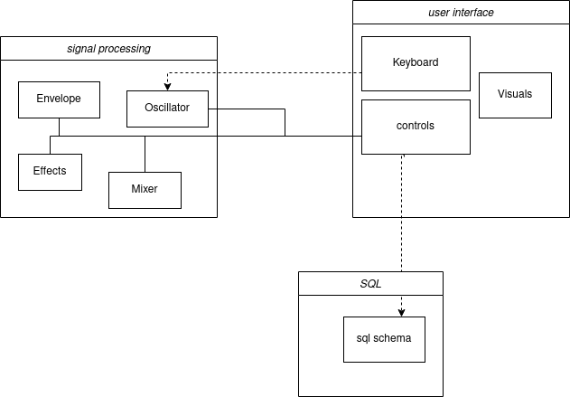
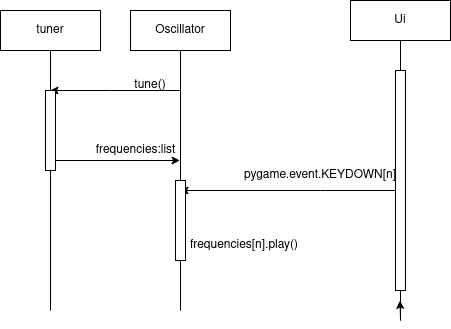

# Sovellusarkkitehtuuri

## Rakenne

Sovelluksen koodi on jaettu kolmeen kansioon: signal prosessing, sql ja user interface. Näistä ensimmäinen sisältää äänen tuottamiseen ja muokkaamiseen liittyvän koodin, toinen tietokantaan liittyvät toiminnot ja viimeinen käyttöliittymän. Main.py-tiedosto alustaa kaikki luokkaoliot ja pitää ohjelman pyörimässä.

## Sovelluslogiikka

### Signaalinkäsittely

Signaalinkäsittelyosion keskiössä on säännöllisten taajuuksien tuottaja eli oskillattori. Oscillator-luokka kutsuu nuottien taajuusluetteloa tuner-moduulista ja aaltomuotoa WaveMixer-luokasta. Kun ääni halutaan soittaa, kutsutaan luokkaa Envelope, joka luo verhokäyrän eli alukkeet ja lopukkeet. Envelope-luokka puolestaan kutsuu Effects-luokasta mahdollisia efektejä.

### Käyttöliittymä

Käyttöliittymässä on kaksi eri ikkunaa: toinen on staattinen ja vihjaa käyttäjälle, millä näppäimillä on käyttöarvoa, kun taas toinen sisältää kaiken käyttäjän säädettävän. Pakkauksessa on kolmas moduuli, joka ottaa vastaan näppäimistöllä tapahtuvan toiminnan ja välittää komennot eteenpäin virittimelle tai oskillaattorille. Käyttöliittymäpakkauksen sisäiset moduulit eivät kommunikoi keskenään.

### Kutsut pakkausten välillä

Käyttöliittymän Controls-luokka syöttää tietoa jokaiseen signaalinkäsittypakkauksen luokkaan. Keyboard-moduuli kutsuu komentoja ainoastaan Oscillator-luokasta. SQL-toiminnot ovat yhteydessä ainoastaan Controls-luokkaan.

## Toiminnallisuudet

Seuraava kaavio kuvastaa syntetisaattorin virittymistä ja äänen soittamista:

