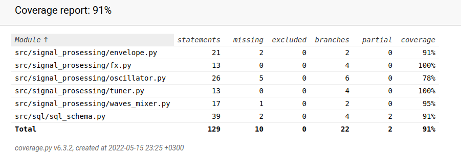

## Testausdokumentti

Ohjelman testaaminen on toteutettu unittestilla ja manuaalisesti.

### Unittest

Unittest-haaraumakattavuus on 91 %. Se kattaa jokaisesta signaalinkäsittelyluokasta vähintään 78 % ja sql-toiminnoista 91 %. Testatessa on käytetty ohjelman lähtökohtaista SQL-tietokantaa, mutta toimivien testien edellyttämänä tietokanta palautuu aina ennalleen.

Unittestien ja haaraumakattavuuden ulkopuolelle on jätetty graafinen käyttöliittymä, koskettimiston toiminta sekä controls-paneeli.

### Käyttöliittymätestaus
Edellä mainituista viimeinen on käyty erityisellä huolella läpi manuaalisesti, koska käyttöliittymä on niin vahvasti sidonnainen muuhun sovelluslogiikkaan. Huolelliseen testaamiesen on lukeutunut mm. nappien painaminen tarkoituksenvastaisesti (esim. load-preset-painikkeen painaminen välittömästi save-preset-painikkeen jälkeen) sekä SQL-injektioyritykset.

### Järjestelmätestaus
Sovelluksen asentamiseen, testaamiseen, lint-tarkistamiseen ja käynnistämiseen liittyvät komennot on tarkistettu manuaalisesti.

### Ongelmia
Sovelluksen sulkeminen controls-paneelista aiheuttaa virheilmoituksen.
